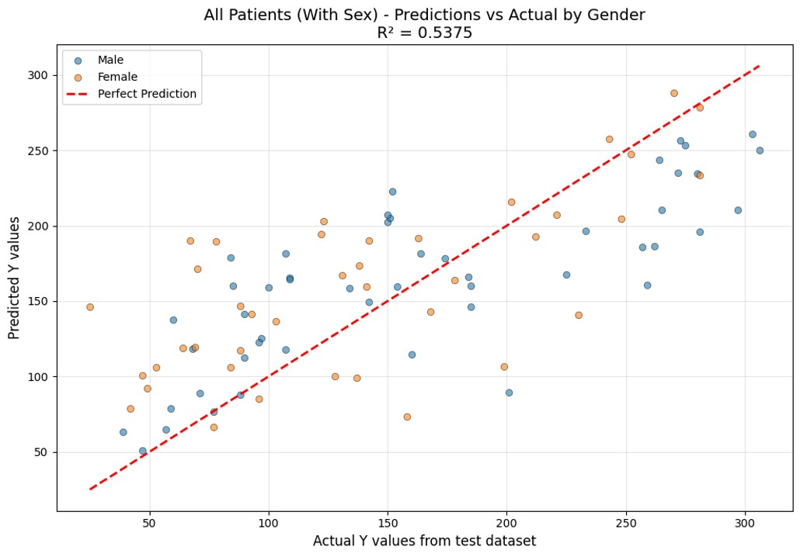

# Diabetes Regression Analysis: Exploring Predictors and Sex Differences

This project applies **linear regression analysis** to a subset of the classic scikit-learn Diabetes dataset, with a specific focus on understanding the impact of the **sex variable** on predicted disease progression. Completed as part of my data science bootcamp work, this project blends exploratory data analysis, regression modelling, and careful interpretation to uncover subtle patterns in biomedical data.

Rather than treating this solely as a mathematical exercise, I extended the analysis to consider whether prediction and interpretation differ between male and female observations. This exploration suggested that **sex information contributes meaningfully to model outcomes**, with potential implications for understanding sex-specific testing and treatment strategies.

### What's in this repository
- **Jupyter Notebook:** step-by-step analysis and findings (`diabetes.ipynb`)
- **Data file:** `diabetes_dirty.csv`  
- **Images:** visuals  
- **Requirements:** Python dependencies (`requirements.txt`)

### Project Overview

The Diabetes dataset includes ten feature variables (age, sex, body mass index, average blood pressure, and six blood serum measurements) and a quantitative measure of disease progression after one year (target variable).

The core task was to:

- Load and clean the dataset for regression analysis  
- Build and evaluate a **linear regression model** to predict disease progression  

I extended the task to:

- Investigate the effect of including the **sex variable** on the model’s predictions  
- Interpret patterns and implications from the regression coefficients

### Approach and Key Insights

This project blends data preparation with analytical modelling:

- **Data cleaning and transformation:** I prepared the dataset by checking for anomalies, confirming that features are correctly scaled and aligned for regression.
- **Linear regression modelling:** I fit a regression model on key predictors to estimate their associations with disease progression.
- **Sex variable evaluation:** By including and excluding the sex feature, I was able to observe how the presence of sex information altered model performance and interpretation — concluding that sex contributes meaningfully to variation in outcomes.
- **Interpretation:** Rather than just reporting coefficients, I assessed how these predictors might relate to clinical considerations, and why distinguishing effects by sex can matter.

### Visual Summaries and Interpretation

  
*Regression fit and residual patterns from the model developed from all patient data and including sex information.*

  
*Model coefficients, highlighting the relative contribution of predictors.*

### Skills Demonstrated

- Exploratory data analysis and feature inspection  
- Linear regression modelling and interpretation  
- Thoughtful inclusion and assessment of feature relevance  
- Python data science ecosystem: pandas, scikit-learn, matplotlib/seaborn  
- Translating numerical modelling into real-world conclusions

### Requirements

Install the required Python packages with: `pip install -r requirements.txt`
